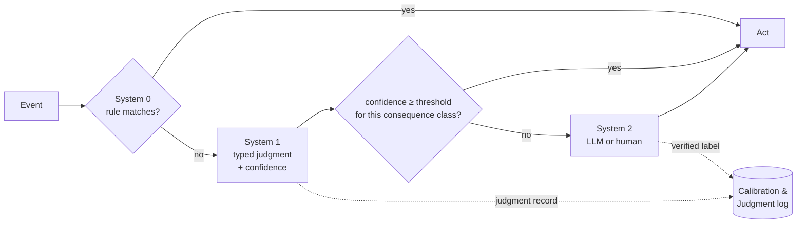

# Cognitive Tiering

*Judgment Architecture · concept · v0.1*

> **Every decision in a system belongs to a tier. Route by consequence × confidence — never by cost alone.**

## Why name the tiers

Teams building with models argue past each other because they picture different things. One person imagines a chatbot deciding everything; another imagines a rules engine with a model bolted on; a third imagines a human approving every step. The argument is really about *which kind of thinking handles which decision* — and there has been no shared vocabulary for it.

Borrowing Kahneman's dual-process framing [1], and the name TypeSafe gave its first model class [2], Cognitive Tiering names three tiers:

| Tier | What decides | Speed | Cost per decision | Can abstain? | Explains itself? |
|---|---|---|---|---|---|
| **System 0 — Rules** | deterministic code, lookups, regexes, schemas | µs | ~0 | no — it matches or it doesn't | yes, fully |
| **System 1 — Judgment** | a decision model: typed choice, score or probability with calibrated confidence | ~100 ms | ~$0.00002 [3] | **yes** | no — it returns probabilities, not reasons |
| **System 2 — Deliberation** | a generative model that reasons, a human, or both | seconds to days | cents to tens of dollars | n/a — it *is* the escalation | yes |

## The routing rule

1. **Try System 0 first.** If a rule settles it, no model should be asked. (TypeSafe's own guidance: keep control flow and deterministic logic in code [4].)
2. **Ask System 1 narrow, typed questions.** Get a judgment and a confidence.
3. **Compare confidence to a threshold set by the consequence class** — not a global number. The threshold comes from [Judgment Economics](judgment-economics.md): `1 − review cost ÷ error cost`, adjusted for measured calibration.
4. **Escalate to System 2** below the threshold. Every escalation returns a verified answer, which becomes a label for recalibrating System 1.

## Consequence classes

The threshold belongs to the *action*, not the model. A starting taxonomy:

| Class | Example | Typical error cost | Typical threshold |
|---|---|---|---|
| **C0 · Observe** | tag, sort, prioritise a queue | near zero | low — act almost always |
| **C1 · Reversible** | send a templated status update, route a ticket | small, one re-contact | moderate |
| **C2 · Costly-reversible** | issue a refund, re-ship, reassign a carrier | real money, recoverable | high |
| **C3 · Irreversible** | file a customs declaration, delete data, move funds | large or regulatory | very high — mostly System 2 |

The same model on the same stream serves all four. What changes is the line. In the [logistics example](../examples/logistics-wismo-hs/README.md), a *"where is my order?"* auto-reply (C1) acts above 0.75; a customs HS-code pre-classification (C3) acts above 0.98.

## What tiering makes visible

- **Where money goes.** Each tier has its own cost line in the [Judgment P&L](judgment-economics.md). Most dashboards only show the model bill, which is the cheapest tier.
- **Where humans go.** System 2 is not a failure path; it is a staffed tier with a budget and a yield (verified labels).
- **What the model is allowed to do.** A consequence class is a permission, stated in business language rather than prompt text.
- **What to explain.** System 0 and System 2 explain themselves; System 1 does not. Where a regulator or customer needs a reason, the design must pair the judgment with a rule trace or escalate.

## Anti-patterns

- **One global threshold** for every decision in the product.
- **Skipping System 0** — asking a model something a regex or a lookup already knows.
- **Asking System 1 to reason** — multi-hop, arithmetic, date comparison. Decision models are literal and do not count [5]. Do the arithmetic in System 0.
- **Treating System 2 as an error handler** — unstaffed, unmeasured, and discarding the labels it produces.
- **Routing by cost alone** — sending an expensive-to-get-wrong decision to the cheapest tier because it is cheap.

## Relationship to other work

Kahneman's System 1 / System 2 describes human cognition; this borrows the names for software tiers and adds System 0 for deterministic code. Several open-source agent harnesses express the same intuition as a slogan — *"deterministic first, semantic second, model last"* [6]. Cognitive Tiering turns it into a routing rule with named consequence classes and prices.

---

### References

1. D. Kahneman, *Thinking, Fast and Slow*, 2011.
2. TypeSafe AI — System One concept. https://docs.typesafe.ai/concepts/system-one
3. TypeSafe AI — Models and pricing. https://docs.typesafe.ai/models ; per-request cost https://jevaiguide.com/jev-review/
4. TypeSafe AI — How to build with System One. https://docs.typesafe.ai/concepts/how-to-build-with-system-one.md
5. TypeSafe AI — Jev 1.13 known limitations. https://docs.typesafe.ai/model-jaggedness/jev-1.13.md
6. Agent Reflex. https://github.com/vuckuola619/reflex
